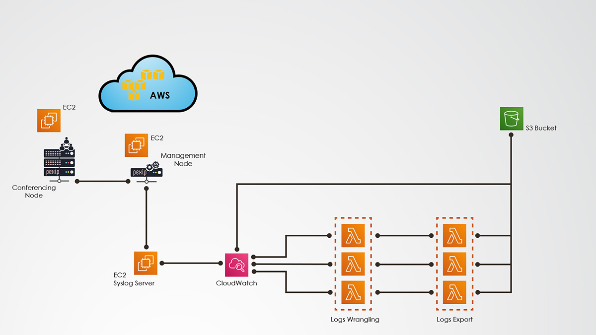

# pexip-logs-in-aws
Pexip Infinity log analysis in the AWS cloud

# What is the purpose of this project?
This is an experiment of using AWS built-in log management, query and analytics tools to help with troubleshooting and searching through the logs of the Pexip Infinity video-conferencing platform.

The Pexip Infinity platform generates 3 types of logs:
  - "audit" logs - the OS/process-level application layer logs of the Pexip Infinity servers,
  - "support" logs - the higher level application logs, e.g. configuration changes, and communications' logs, e.g. SIP, H.323, ICE, REST... communication logs,
  - "web server" logs.

So far this project only deals with the "audit" and "support" logs,  not the "web server" logs.

# How does it work?
I have created a demo which I published on YouTube in two parts:
  - part 1: shows how to get the logs into AWS CloudWatch Logs, how the provided Lambda function wrangles the logs in JSON and another function exports them into back into CloudWatch Logs and/or S3: https://youtu.be/2Pf4KuHPsZQ
  - part 2: -- coming soon --
  
# How do I get started?
  - Create an S3 bucket in your AWS account to store the code, and config files
  - Download this repository
  - Copy the files from the repository "code_and_config/" into a "code/" 'folder' inside your S3 bucket
  - Create a CloudFormation Stack using the "cf_template.yaml" and give your bucket name when asked for it
  - Deploy manually an EC2 linux instance, install on it a Syslog server and CloudWatch Agent, configure it (see the Wiki section "Configuration of the CloudWatch Logs Agent") and apply to the EC2 instance the IAM Role "Role_for_EC2_Syslog_Server" provisioned by the CloudFormation template

Look at this project's wiki for more details: https://github.com/mlnrt/pexip-logs-in-aws/wiki

# Credits
The code of the Lambda functions "Pexip_Logs_Wrangling" and "Pexip_Logs_Export" is based on the code written by 
  @ V.Megler 
  @ Amazon.com 
  @ August 2017  
provided in this blog post: https://aws.amazon.com/blogs/mt/how-to-export-ec2-instance-execution-logs-to-an-s3-bucket-using-cloudwatch-logs-lambda-and-cloudformation/
