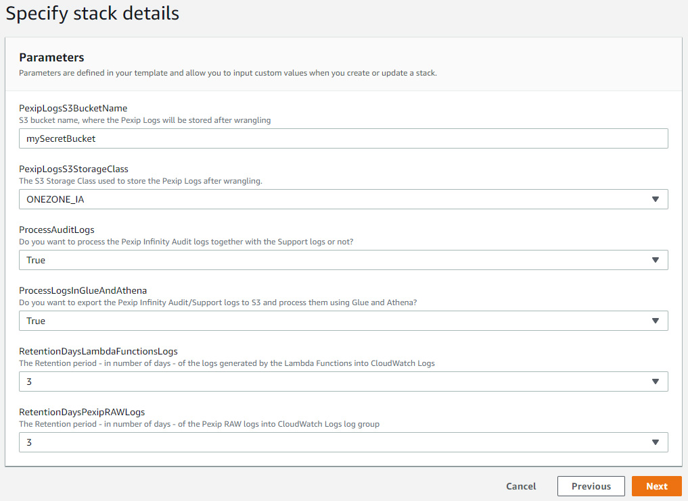
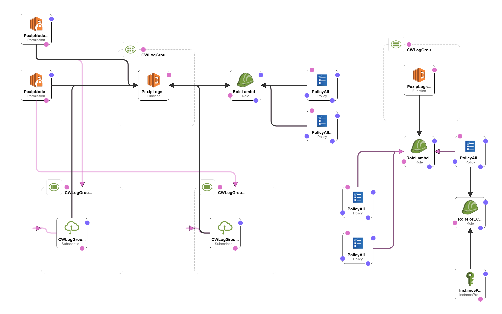
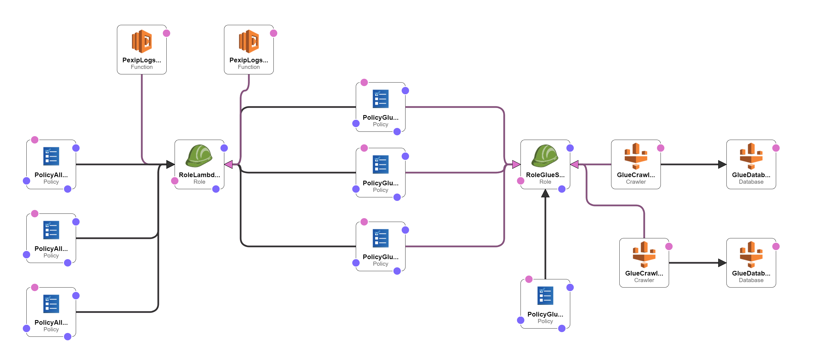

# pexip-logs-in-aws
Pexip Infinity log analysis in the AWS cloud

# What is the purpose of this project?
This is an experiment of using AWS built-in log management, query and analytics tools to help with troubleshooting and searching through the logs of the Pexip Infinity video-conferencing platform.

The Pexip Infinity platform generates 3 types of logs:
* "audit" logs - the OS/process-level application layer logs of the Pexip Infinity servers,
* "support" logs - the higher level application logs, e.g. configuration changes, and communications' logs, e.g. SIP, H.323, ICE, REST... communication logs,
* "web server" logs.

So far this project only deals with the "audit" and "support" logs,  not the "web server" logs.

# How does it work?
I have created a demo which I published on YouTube in two parts:
* part 1: shows how to get the logs into AWS CloudWatch Logs, how the provided Lambda function wrangles the logs in JSON and another function exports them into back into CloudWatch Logs and/or S3: https://youtu.be/2Pf4KuHPsZQ
* part 2: -- coming soon --

# How do I get started?
* Create an S3 bucket in your AWS account to store the code, and config files
* Download this repository
* Copy the files from the repository "code_and_config/" into a "code/" 'folder' inside your S3 bucket
* Create a CloudFormation Stack using the "cf_template.yaml" and give your bucket name when asked for it
* Deploy manually an EC2 linux instance, install on it a Syslog server and CloudWatch Agent, configure it (see the details below in the section "Configuration of the CloudWatch Logs Agent") and apply to the EC2 instance the IAM Role "Role_for_EC2_Syslog_Server" provisioned by the CloudFormation template

# What does the code repo contain?
It contains
* -- coming soon -- an AWS CloudFormation YAML template which will provision most of the needed resources (IAM roles, CloudWatch Logs log groups, Lambda Functions, Glue databases and tables...),
* -- coming soon -- the code for the Lambda functions,
* a configuration sample file for the AWS CloudWatch Logs Agent which must be installed on the Syslog server (IMPORTANT: use the same names for the CloudWatch Logs' log group and log stream - see the details below),
* a log metadata file, containing the data structure of all the types of Pexip Infinity logs I have seen in my lab. It is used by the two Lambda Function which create all the AWS Glue tables and partitions based on the processed log files already stored in S3. If some types of logs are missing (and some are for sure, like logs for the integration with Microsoft SfB and Teams, which I do not have in my lab) in this case run the provided Glue Crawler (provisioned through the CloudFormation template) against the corresponding log folder in S3.
  
# Using the CloudFormation template

## What does the template include?
The CloudFormation template allows you to choose if you want to:
* process in AWS both the "audit" logs and the "support" logs or just the "support" logs.
* try to Export the logs after wrangling in S3, to process them in AWS Glue and Athena too, or just use CloudWatch Logs.

Based on your choices, CloudFormation will provision the below resources:
  - The IAM Roles, Policies for:
    - the EC2 instance which will host your Syslog server, together with the InstanceProfile to be able to attach the role to the EC2 instance.
    - the Lambda Functions
    - the Lambda Permission for the log wrangling function to subscribe to the CloudWatch Logs' log stream
    - the Glue Databases (if you chose the option #2)
    - the Glue Crawlers (if you chose the option #2)
  - The CloudWatch Logs' log groups for the "support" logs and the "audit logs" (if you chose to process those too)
  - The Lambda Functions to wrangle and the Pexip logs
  - The subscription for the log-wrangling Lambda Function to the CloudWatch Logs' log groups of the Pexip Infinity "support" and "audit" logs
  - The Lambda Functions to create the Glue Tables and Tartitions (if you chose the option #2)
  - The Glue Databases and Crawlers (if you chose the option #2)

## What the template does NOT include?
The CloudFormation template does not include:
  - the provisioning of an EC2 instance to host the Syslog server.
  - configure the Syslog server with the CloudWatch Logs Agent. See the details below.
  - create all the Glue Tables and Partitions for all the types of logs. See the details below.
  
# Some technical information

## Configuration of the CloudWatch Logs Agent
You will have to deploy your EC2 Syslog server yourself and install the CloudWatch Logs Agent yourself. SeeAWS documentations
  - to install the Agent on a Linux EC2 instance: https://docs.aws.amazon.com/AmazonCloudWatch/latest/logs/QuickStartEC2Instance.html
  - to configure the Agent: https://docs.aws.amazon.com/AmazonCloudWatch/latest/logs/AgentReference.html

In the code_and_config folder, I provide the awslogs.conf file I am using on my Syslog server.
  - IMPORTANT: do not change the names of the CloudWatch Logs' log stream or log groups otherwise the IAM Policies and Roles created by the CloudFormation template won't give access to the correct log groups and the Lambda Function wrangling the logs won't get subscribed to the correct log group
  - If you are not interested in processing the Pexip Infinity "audit" logs and haven't configured the Pexip Infinity server to send the audit logs to this Syslog server, remove the "Pexip_Management_Server_Audit_Logs" and "Pexip_Conference_Server_Audit_Logs" configuration
  - Adjust parameters like the buffer_duration, based on your environment and the amount of logs it generates (see the section below "I am missing logs in CloudWatch Logs...").

## Using Glue and Athena
The CloudFormation template does not create all the Glue Tables for each of the Pexip Infinity "audit" and "support" log types.
Instead, I provide few things:
  - a log metadata file "pexip_logs_metadata.json", which contains the definition of the data structure of all the types of logs generated by Pexip Infinity (warning - some are missing for sure),
  - a Lambda Function "Pexip_Logs_Create_Glue_Tables" to create the Glue Tables for each log type defined in the metadata file,
  - a Lambda Function "Pexip_Logs_Create_Glue_Tables_Partitions" which will create the Glue Tables' partitions for the data stored in S3,
  - Two Glue Crawlers, one for the "audit" logs and one for the "support" logs, that you can run manually to crawl new types of logs generated by Pexip Infinity platform and not defined in the metadata file.

To use it:
  - Once you have provisioned the template and got the system running for some time, and logs formatted in JSON are stored in S3 by the "Pexip_Logs_Wrangling" and "Pexip_Logs_Export" Lambda functions, you will have to run manually the "Pexip_Logs_Create_Glue_Tables" function with an empty test event "{}" and the environment parameter "CREATE_OR_UPDATE_TABLES_PARTITIONS_AT_THE_SAME_TIME" set to "True" and it will create all Glue Tables for all the logs defined in the metadata file and create all the partitions for all tables based on the data stored in S3.
  - If new types of logs not defined in the metadata file are generated, run the corresponding Glue Crawler ("Crawl_Pexip_Support_Logs" or "Crawl_Pexip_Audit_Logs"), pointing it to the S3 folder containing the new types of Logs. Once the Crawler has generated the Table and partitions, go into the Table, Edit the schema, and change the partitions names (partition_0 -> year_partition | partition_-1 -> month_partition | partition_2 -> day_partition)

## Lambda Functions logs
All the provided Lambda Functions output their own logs into their own CloudWatch Logs' log group in the format "/aws/lambda/function-name" (e.g. "/aws/lambda/Pexip_Logs_Wrangling") for debugging purposes.
For each function there is an environment variable called "DEBUGGING_LOG_LEVEL" which you can use to control the level of logs the function will output to CloudWatch Logs:
  - "Info": will output a very limited amount logs; mainly just the logs about the function start and end, and when it invokes another lambda Function (e.g. when the wrangling function evokes the export function),
  - "Detailed": will output, well... detailed logs of each of the steps performed (e.g. when the wrangling function is parsing a log massage)
  - "Debug": will output a lot of data, like the entire JSON event received by the function, the JSON formatted logs after wrangling, or the JSON data read in the "pexip_logs_metadata.son" file... This can quickly become a high volume of logs on a production environment so be careful.

If you just want to see what the functions do, use the "Detailed" level. Use the "Debug" level only if you have some logs missing or the functions fail to execute. If you do not need any log, set the log level of all functions to "Info".

By default, the Lambda Functions are set in the CloudFormation template with a log level of "Detailed".

## Missing logs in CloudWatch Logs?
If you find that some logs are missing, here are some possible reasons:
  - adjust on the EC2 Linux Syslog server the CloudWatch Logs Agent "buffer_duration" parameter and the Lambda Function "Pexip_Logs_Wrangling" timeout. The buffer_duration controls the time interval during which the CloudWatch Agent will wait and accumulate logs before sending them to CloudWatch Logs. The higher the buffer the more logs are send at once to CloudWatchLogs. If the buffer is too high (one batch of logs will have many, many log messages), and the Lambda Function timeout is too low (default=30 seconds), the Lambda Function might be terminated, before it was able to wrangle all the logs. Look in the Lambda Function's own logs in the CloudWatch Logs' log group /aws/lambda/Pexip_Logs_Wrangling for "Task timed out" events.
  - the "Pexip_Logs_Export" function has timed out before writing all the logs to CloudWatch Logs.
  - if you try to use Glue and Athena, there are for sure logs missing in the provided file "pexip_logs_metadata.json". See the above section "Using Glue and Athena".
  - the provided Lambda Function used to create the Glue Tables, sets the table's parameter to ignore logs that are not well formatted. You can end up with missing logs in the tables' partitions if:
    - the data structure of a log was not defined correctly in the metadata file, 
    - the log data format has changed in a new version of Pexip Infinity (the table's schema do not match the logs' structure anymore),
    - the logs were not wrangled properly by the "Pexip_Logs_Wrangling" function,
    - logs were received corrupted,
  - there are bugs in the code.

# Credits
The code of the Lambda functions "Pexip_Logs_Wrangling" and "Pexip_Logs_Export" is based on the code written by 
  @V.Megler 
  @Amazon.com 
  @August 2017  
provided in this blog post: https://aws.amazon.com/blogs/mt/how-to-export-ec2-instance-execution-logs-to-an-s3-bucket-using-cloudwatch-logs-lambda-and-cloudformation/logs-lambda-and-cloudformation/
